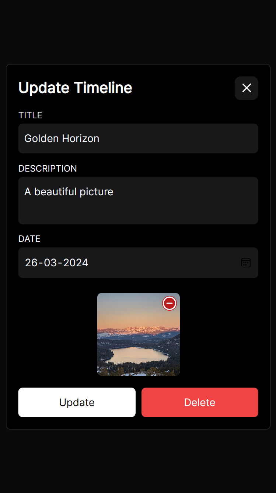

# TimeLine - A simple timeline of your memories

## Description

This project is simple timeline of your memories. You can post a picture with title a description and a date. The timeline will show the events in chronological order. it has a simple authentication system using Firebase Authentication and a simple backend using Firebase Firestore and Firebase Storage. It has a simple form to add a new event and a simple card to show the event.All the events are stored in the Firestore database and the images are stored in the Firebase Storage.

_Anything you share can be view by anyone who has logged in so be careful with the information you share._

## Demo Link

[TimeLine](https://vangu.pages.dev)

### Page and screenshots

| Page              | Screenshot                                                             |
| ----------------- | ---------------------------------------------------------------------- |
| Login Page        |            |
| Empty Page        |            |
| Add Page          |        |
| Update Page       |     |
| Full Screen image |  |
| Home page         |             |

## Technologies

- Angular 17
- Tailwind CSS
- Tailwind animations
- Firebase (Firestore, Storage, Authentication)
- @angular/fire (Angular library for Firebase)
- Cloudflare Pages (Hosting)

## Installation

To install the project you need to clone the repository and run the following command:

```bash
git clone https://github.com/amrohan/timeline.git
```

Then you need to install the dependencies using the following command:

```bash
npm i
```

Then you need to create a Firebase project and enable Firestore, Storage, and Authentication. Then you need to create a web app and copy the configuration object and paste it in the environment.ts file in the environment object.

```typescript
    export const environment = {
      production: false,
      firebaseConfig: {
        apiKey: "YOUR_API KEY",
        authDomain : "YOUR_AUTH_DOMAIN",
        projectId : "YOUR_PROJECT_ID",
        storageBucket : "YOUR_STORAGE
        messaging: "YOUR_MESSEGING",
        appId: "YOUR_APP_ID"
      }
    };
```

Also create .env file in the root directory and add the following:

remove the environment object from the environment.ts file and add the following:

```bash
touch .env
```

```bash
FIREBASE_API_KEY=YOUR_API_KEY
FIREBASE_AUTH_DOMAIN=YOUR_AUTH_DOMAIN
FIREBASE_PROJECT_ID=YOUR_PROJECT_ID
FIREBASE_STORAGE_BUCKET=YOUR_STORAGE
FIREBASE_MESSAGING_SENDER_ID=YOUR_MESSEGING
FIREBASE_APP_ID=YOUR_APP_ID
```

<!-- Alert user that he should have two file environment.development.ts & environment.ts environment.ts will be run while in production also there is config.js that writes reads the .env from folder and copies data into environment.ts file on the time of the produciton-->

> :warning: **Important**: You should have two files: `environment.development.ts` and `environment.ts`. The `environment.ts` file will be run while in production. Additionally, there is a `config.js` file that reads the `.env` from the folder and copies data into the `environment.ts` file at the time of production. you can modify according to your needs.

Then you need to enable the Firestore and Storage rules to allow read and write access to the database and storage.

```text
    rules_version = '2';
    service cloud.firestore {
      match /databases/{database}/documents {
        match /{document=**} {
          allow read, write: if request.auth != null;
        }
      }
    }
```

For the Storage rules:

```text
    rules_version = '2';
    service firebase.storage {
      match /b/{bucket}/o {
        match /{allPaths=**} {
          allow read, write: if request.auth != null;
        }
      }
    }
```

Then you need to enable the email/password authentication in the Firebase Authentication.

Then you need to run the following command to start the project:

```bash
ng serve -o
```

Then you can open the browser and navigate to `http://localhost:4200` to see the project.

## Usage

Details about how to use the project.

User can add a new event by clicking on the add event button and filling the form with the title, description, date, and image. The image should be less than 1MB. The user can also delete the event by clicking on the delete button. The user can also sign in using the email and password. The user can also sign out by clicking on the sign-out button.

## Contributing

Information about how to contribute to the project.
For contributing to the project you can fork the repository and create a new branch and make changes to the project and then create a pull request to the main repository.
Note: The project is still in development and there are many features that can be added to the project.

## FAQ

Questions that are frequently asked.

1. Can I use the project for commercial purposes?
   Ans: Yes, you can use the project for commercial purposes.

2. Can I modify the project according to my needs?
   Ans: Yes, you can modify the project according to your needs.

3. Can I contribute to the project?
   Ans: Yes, you can contribute to the project by forking the repository and creating a pull request.

4. Can i deploy the project to the cloud?
   Ans: Absolutely, this project is fully capable of being deployed to the cloud. Cloudflare Pages is a viable option, but the flexibility of the project allows for deployment on any platform of your preference.

## License

MIT License
Feel free to use the project and modify it according to your needs.

## Author

Any questions or feedback can be directed to the author:

- [Twitter](https://twitter.com/amrohxn)
- [Telegram](https://t.me/amrohan)
- [LinkedIn](https://www.linkedin.com/in/amrohan/)
